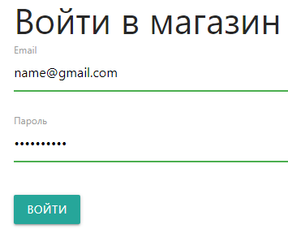
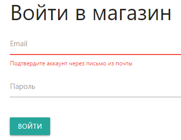
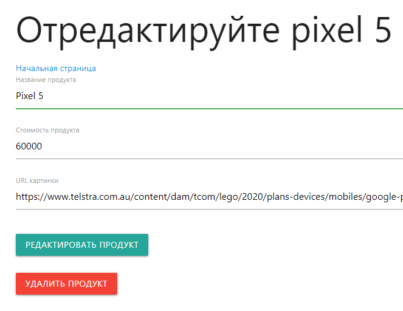
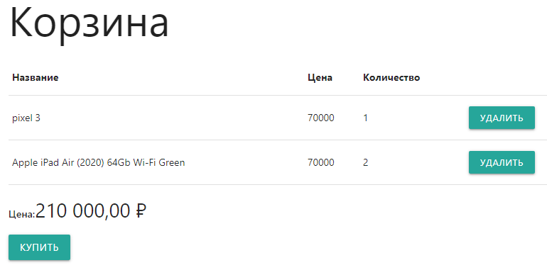
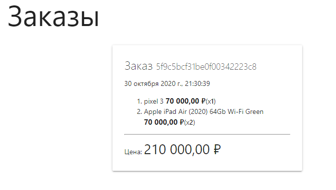

[](https://training-store-test.herokuapp.com/)
___
## Установка проекта
Подключить `git` репозиторий.
```
$ git remote add origin https://github.com/Egoka/StoreTraining.git
```
Установить зависимости из файла `package.json`
```bash
$ npm install
```
Запустить сервер по адресу [`http://localhost:3000`](http://localhost:3000)
```bash
$ npm start
```
___
## Описание проекта
Проект был направлен на изучение таких пакетов как:
* `path` для работы с путями к файлам и директориям 
* `express` веб-фреймворк для приложений Node.js
* `mongoose` ODM-библиотеку для работы с MongoDB
* `express-session` предназначен для сохранения данных о сеансе на сервере
* `express-validator` набор методов для валидации входных данных

Сайт состоит из рабочей области и панели навигации (`navbar`).
На сайте реализована возможность регистрации и ведения личной информации.



Для незарегистрированного пользователя доступен только просмотр имеющихся продуктов и их параметров.
После регистрации пользователя, приложение принуждает пользователя подтвердить свою личность по ссылке пришедшей в письме.



После входа в свой аккаунт, пользователю получает доступ на создание, редактирование и удаление собственного продукта.



Кроме собственной продукции, пользователь может добавлять или удалять любые продукты из магазина в корзину.



После составления корзины, пользователь может сделать заказ, где будет указан номер заказа и дата, когда он был сделан.

